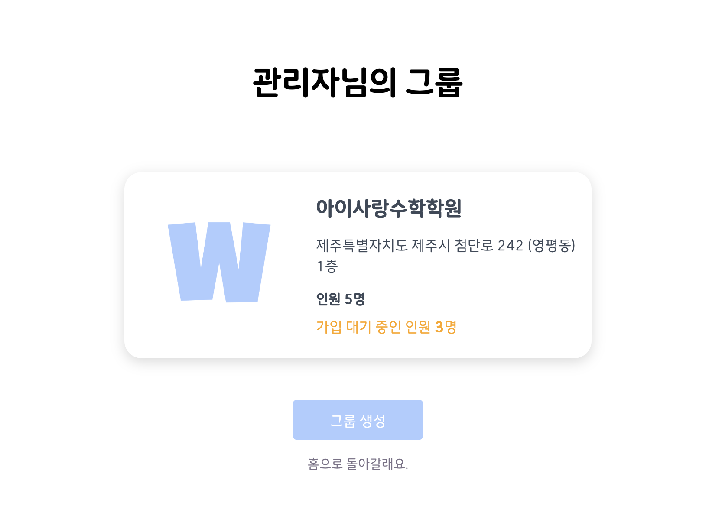
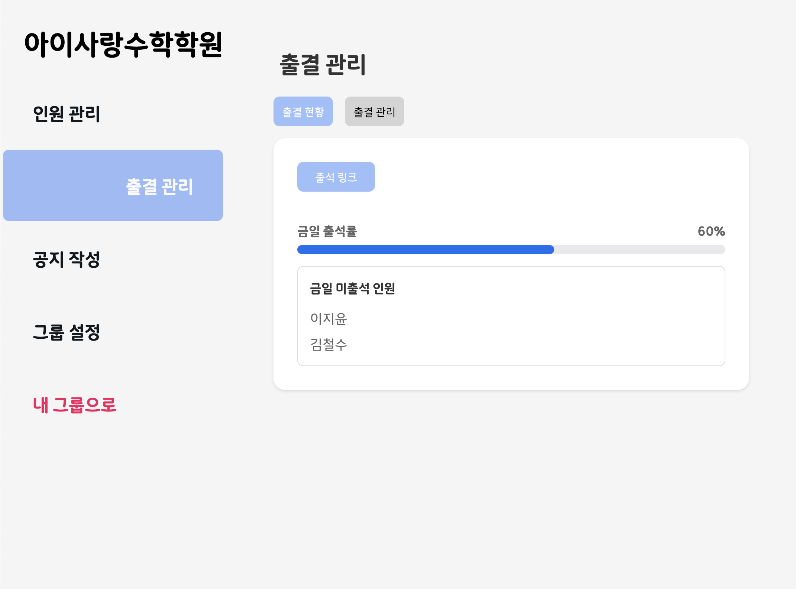
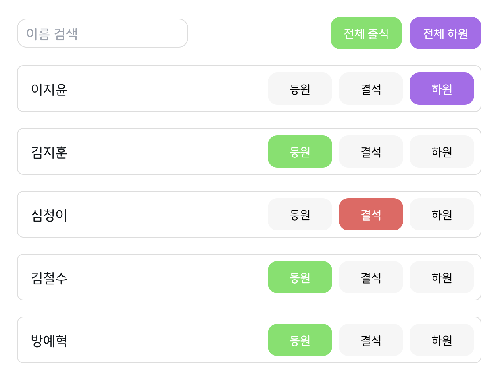
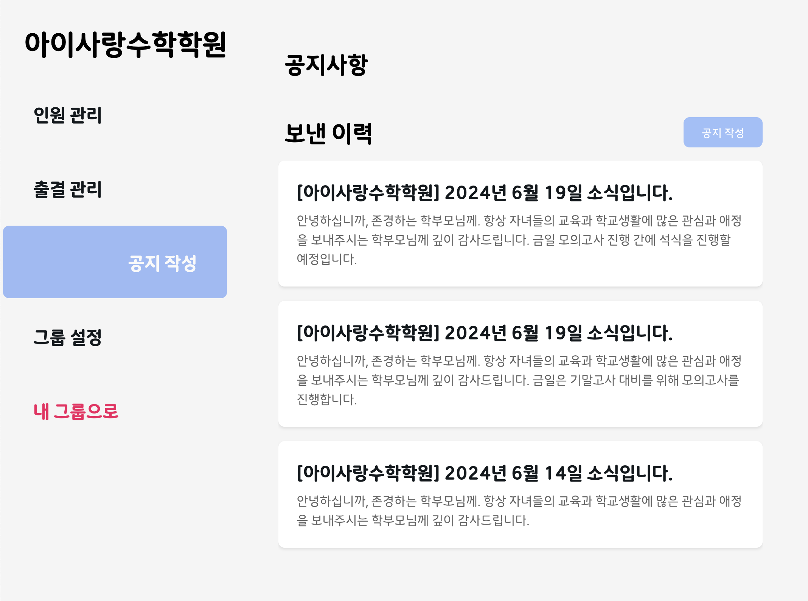
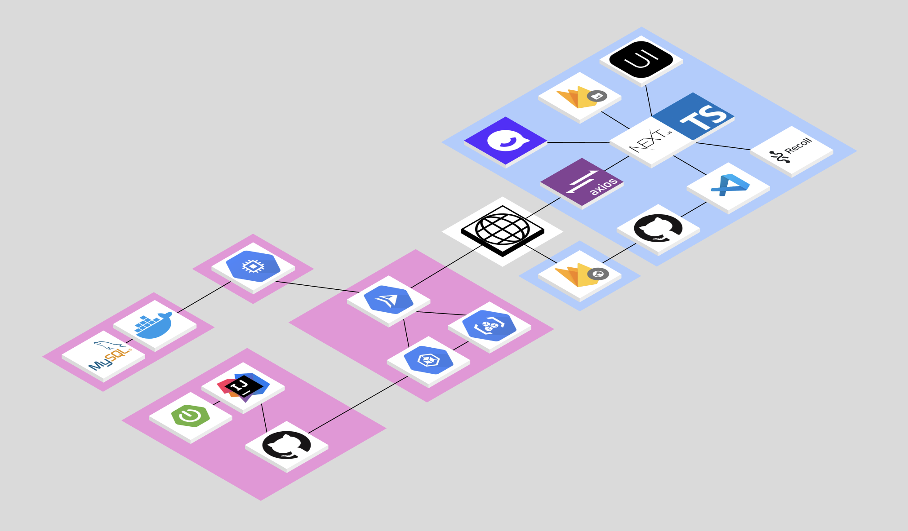

## WASSUP-Web

성공회대학교 소프트웨어 캡스톤 디자인 프로젝트입니다.

## 📌 와썹 소개

- **WASSUP**은 학원에서 사용할 수 있는 원생 출결 관리 서비스입니다.
- 데스크에서 쉽게 출석할 수 있습니다.
- 안심 등하원 메시지를 제공합니다.
- 관리자는 출석 현황을 확인할 수 있고, 간단하게 출석 상태를 변경할 수 있습니다.
- 관리자는 여러 개의 그룹을 생성하고, 그룹별로 출석 현황을 확인할 수 있습니다.
- 관리자는 개인 또는 그룹별로 공지사항(가정통신문)을 작성할 수 있습니다.
- 관리자는 그룹에 속한 인원들의 정보를 관리할 수 있습니다.

## 📌 와썹 미리보기












## 📌 프로젝트 기간

- 2024.03 ~ 2024.6

## 📌 팀원

|                                                        Yehyeok Bang                                                        |                                                       Jiyun Lee                                                        |
| :------------------------------------------------------------------------------------------------------------------------: | :--------------------------------------------------------------------------------------------------------------------: |
| <a href="https://github.com/YehyeokBang"></a> | <a href="https://github.com/dd-jiyun"></a> |
|                                                            Web                                                             |                                                         Server                                                         |

## 📌 프로젝트 구조



| Tech                | Version | Description                                            |
| :------------------ | :------ | :----------------------------------------------------- |
| Node.js             | 21.2.0  | JavaScript 런타임 환경                                 |
| Next.js             | 14.1.3  | React Framework                                        |
| React               | 18      | -                                                      |
| TypeScript          | 5.2.2   | -                                                      |
| NextUI              | 2.2.10  | 모던한 디자인을 제공하는 UI 라이브러리                 |
| Framer-motion       | 11.0.20 | 애니메이션 라이브러리                                  |
| axios               | 1.6.8   | HTTP 클라이언트 라이브러리                             |
| formik              | 2.4.5   | Form 라이브러리                                        |
| yup                 | 1.4.0   | 스키마 기반 유효성 검사 라이브러리, formik과 함께 사용 |
| recoil              | 0.7.7   | 상태 관리 라이브러리                                   |
| recoil-persist      | 5.1.0   | recoil 상태를 로컬 스토리지에 저장하는 라이브러리      |
| firebase            | 10.10.0 | 이미지 저장 및 호스팅 사용                             |
| uuid                | 9.0.1   | 고유한 ID 생성 라이브러리, 이미지 파일명 생성에 사용   |
| react-daum-postcode | 3.1.3   | 다음 우편번호 서비스를 사용한 주소 검색 라이브러리     |

## 📌 실행 방법

```
$ git clone
$ cd wassup
환경 변수를 포함한 .env.local 파일을 프로젝트 루트에 생성
$ npm i
$ npm run dev
로컬에서 접속: http://localhost:3000
```
